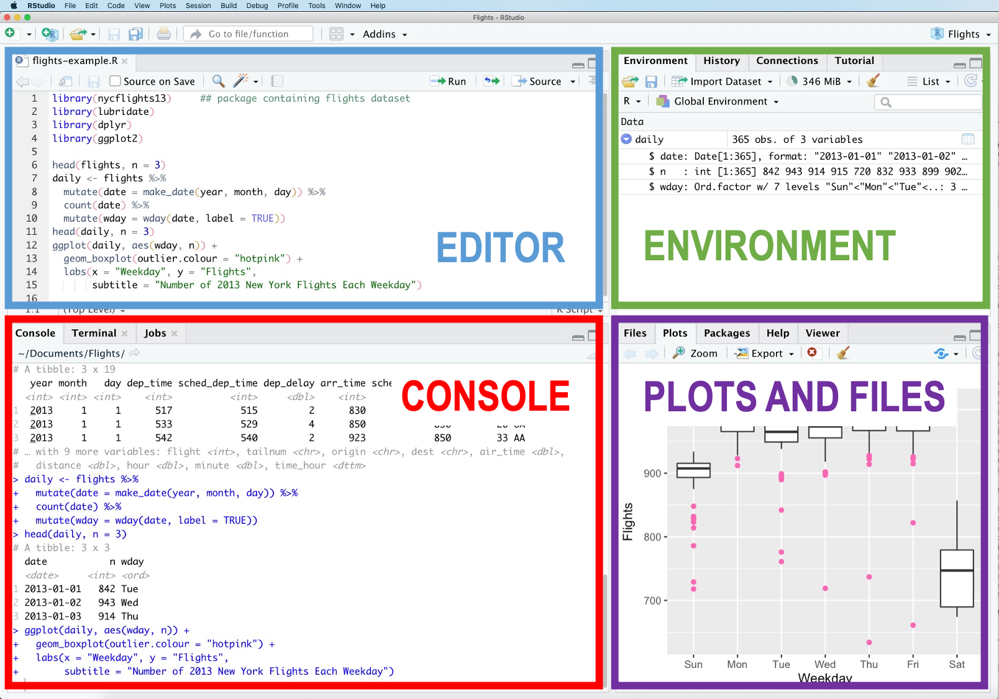

```{r setup, include=FALSE}
knitr::opts_chunk$set(echo = FALSE, fig.align = 'center')
```

```{r panelset, echo=FALSE}
xaringanExtra::use_panelset()
```


## Prelude

Writing scientific and statistical reports can be a laborious process. Typically, data analysis has been conducted using one piece of statistical analysis software, and the writing process takes place in another (e.g. Microsoft Word). This means the author needs to get the information from the analysis software into the word processing software. This introduces a lot of room for error (e.g. you write the wrong numbers in your paper), and even more room for frustration (your analysis changes slightly and all your numbers change, meaning you have to re-copy everything across). 
RMarkdown aims to solve this, by allowing you to combine your analysis and write-up in one, fully reproducible document.  

## What you need

1. __A laptop__
2. __R and Rstudio__  
Either a locally installed version of R and RStudio on your laptop, or access to RStudio on a server. 
3. Very basic knowledge of programming in R __(see below).__
4. __Active learning__  
Just reading the material won’t be enough, you need to type along the code and get familiar with errors.
5. __Willingness to learn__  
If you approach the material with an inquisitive attitude, it will be easier to learn.

## Experience with R/Rstudio 

This course assumes that the reader has had some experience of using RStudio and programming in R. 
For an indicator, we will assume that the reader is familiar with the code below and understands what each line will do.  

```{r echo=T,eval=F}
library(tidyverse)
tipjoke <- read_csv('https://uoepsy.github.io/data/TipJoke.csv')
tiptable <- table(tipjoke$Card, tipjoke$Tip)
tiptable

pass_scores <- read_csv("https://edin.ac/2wJgYwL") 
barplot(table(pass_scores$school))
t.test(pass_scores$PASS, mu = 33, alternative = "less")
pass_scores %>% group_by(school) %>%
  summarise(
    meanPASS = mean(PASS),
    sdPASS = sd(PASS)
  )
```

We also assume that the reader is familiar with the general setup of the RStudio IDE (Figure \@ref(fig:ide)).  
Writing in RMarkdown is similar to writing in an R Script - it involves writing code in the Editor pane, which can then be sent to the Console to be evaluated. The only difference is the addition of the written text component in the file we have open in the Editor. 

```{r ide, echo=FALSE, fig.cap="RStudio Interface"}

```


