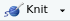

```{r setup, include=FALSE}
knitr::opts_chunk$set(fig.align = 'center')
```

```{r panelset, echo=FALSE}
xaringanExtra::use_panelset()
```


```{css echo=FALSE}
.spc1{
  background-color: #eaeaea;
}
.frame {
    border: 1px solid #333333 !important; 
    border-radius: 5px; 
    padding: 20px 20px 10px 20px; 
    margin-top: 20px; 
    margin-bottom: 20px; 
}
.imp{
  border-left: 5px solid #FF3131;
  padding: 20px 20px 10px 20px; 
  margin-top: 20px; 
  margin-bottom: 20px; 
}
```

## What does it mean to "compile" a document?

```{r render, echo=FALSE, fig.cap="Rendering (from https://www.rstudio.com/wp-content/uploads/2015/02/rmarkdown-cheatsheet.pdf)"}

```

Often, when talking about "compiling" RMarkdown documents, you will find different words used for this process, such as "compiling", "rendering", and "knitting".  

The basic idea is that we are turning the **.rmd** file we are editing in RStudio into something much more reader-friendly, such as a **.pdf**, or an **.html**, or even a word file **.docx**. 

```{r echo=F, fig.align="left", out.width="75px"}

```
If you open up the **.rmd** file from [Lesson 1](01-basics.html), and click the "knit" icon at the top of the document, you see lots of stuff happening below, and then a nicely formatted document will pop-up. 
(**Note:** If you have not already saved your RMarkdown document (hopefully you have!), then when you click "knit", it will prompt you to save it first.)

<center>
__Compiling a document__  
<video width="320" height="240" controls>
  <source src="vids/knit1.mp4" type="video/mp4">
</video></center>

:::rtip
You may find that the document pops up in a separate window, or in the "viewer" pane in the bottom right of RStudio.  
You can control this behaviour by looking in the top menu of RStudio for __"Tools" > "Global Options" > "RMarkdown" > "Show output preview in:"__. 

:::

## Compiled Files

The compiled file will be in the same folder as where you have saved your __.rmd__ file. If you are using an "Project", or have set your working directory using `setwd()` (see [r-bootcamp Lesson 2](https://uoepsy.github.io/r-bootcamp/02-data.html#directories)) then you can fine these easily in the Files tab of RStudio. You can also find these in your file-browser that you use to find all your other files on your computer.

<center>
__Locating .rmd and compiled document when using a Project__  
<video width="320" height="240" controls>
  <source src="vids/files.mp4" type="video/mp4">
</video></center>


You should now have **TWO** files on your computer with the same name but one is an **.Rmd** and one is a **.html**. You could email the **.html** file to someone and they could open it in their web browser. The **.Rmd** file can only be opened and understood by someone who has access to R. 

## Compiling and Sessions/Environments

:::imp
When an RMarkdown document gets compiled, it does so as a __self-contained process.__ This ensures reproducibility! 

It doesn't matter what you can see in your Environment, nor what packages you have loaded.  
What matters is what is __in__ the RMarkdown document.  

When you click "knit", the lines of code in your RMarkdown document will be evaluated one-by-one, and the document must contain __everything__ required to evaluate each line.  

For example:

- if you have not got a line _in your document_ that loads the tidyverse packages, then you will not be able to use functions like `group_by()`,`filter`,`%>%` etc in the document, because it won't know where to find them.  
- if you have not got the line that loads the tidyverse packages __before__ you use functions like `group_by()`,`filter`,`%>%` etc, then it won't know where to find them. 

Where is the RMarkdown looking for objects/functions, if not your environment? It's looking in its own environment! 

:::

<center>
__Demonstration of compiling without defining objects__  
<video width="320" height="240" controls>
  <source src="vids/compilingenv.mp4" type="video/mp4">
</video></center>

## The "setup" chunk

Because compiling an RMarkdown document requires everything necessary for all the code to run __without errors__ to be included in the document and in the correct order, there is an optimum way to structure your document.  
Immediately after the metadata (title, author etc), we specify the "setup" chunk (see below). 
In the setup chunk, we typically load __all__ the packages we rely on in the rest of the document, so that they get loaded first.^[Don't use `install.packages()` here - or it will re-install the package every time you compile. Just use `install.packages()` in the console.] It is also typical to use this chunk to read in your data.  
You can see an example below. 


:::frame

```{}
---
title: "this is my title"
author: "I am the author"
date: "13/08/2021"
output: html_document
---
```
<div class="spc1"><code>&grave;&grave;&grave;{r setup, include = FALSE}
```
library(tidyverse)
library(palmerpenguins)
somedata <- read_csv("https://edin.ac/2wJgYwL")
```
&grave;&grave;&grave;</code></div>

:::

:::imp

Note we now have some more stuff inside the brackets which start our code-chunk.  
Instead of 
<div class="spc1"><code>&grave;&grave;&grave;{r}</code></div>
we now have 
<div class="spc1"><code>&grave;&grave;&grave;{r setup, include = FALSE}</code></div>
The first bit, `setup` is simply the name of our code-chunk. 
We can call it anything we want, for instance:  
<div class="spc1"><code>&grave;&grave;&grave;{r peppapig}</code></div>
The second bit, the `include = FALSE` is what is known as a "chunk-option", and we will get to these later on. What this does is basically mean that neither this chunk of code nor its output will be visible in the compiled document. 
:::

