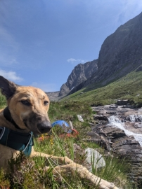

```{r setup, include=FALSE}
knitr::opts_chunk$set(fig.align = 'center')
```

```{r panelset, echo=FALSE}
xaringanExtra::use_panelset()
```


```{css echo=FALSE}
.spc1{
  background-color: #eaeaea;
}
.spc1 code{
  font-size: .8em !important;
}
.frame {
    border: 1px solid #333333 !important; 
    border-radius: 5px; 
    padding: 20px 20px 10px 20px; 
    margin-top: 20px; 
    margin-bottom: 20px; 
}
.imp{
  border-left: 5px solid #FF3131;
  padding: 20px 20px 10px 20px; 
  margin-top: 20px; 
  margin-bottom: 20px; 
}
```


# Plots vs External image files

  
We have already seen how we can include a plot in a document, by creating the plot in a code-chunk:
  
```{r}
pass_scores <- read.csv("https://edin.ac/2wJgYwL")
barplot(table(pass_scores$school))
```
However, we can also include images from files stored locally on our computer, or stored on the internet. We can do so using the `include_graphics()` function from the __knitr__ package:

<div class="spc1"><code>
&grave;&grave;&grave;{r}<br>
library(knitr)<br>
include_graphics("https://edin.ac/37Ml3Q2")<br>
<br>
&grave;&grave;&grave;
</code></div><br>

```{r out.width="150px"}
library(knitr)
include_graphics("https://edin.ac/37Ml3Q2")
```

```{r out.width="200px"}

```

# Figure options

We can use a lot of extra options to control the output of plots and figures. These are set as code-chunk options (see the [Lesson on hiding code and output](05-echoeval.html)). A couple of the main ones are detailed below

## width and height

::: {.panelset}

::: {.panel}
#### Resize Any Image

To simply scale up/down any image at all, we can use the `out.width` and `out.height` options to set the height and width. Personally, I find it easiest to use these with pixels as the units:

Writing this: 

<div class="spc1"><code>
&grave;&grave;&grave;{r out.width="150px"}<br>
include_graphics("https://edin.ac/37Ml3Q2")<br>
barplot(table(pass_scores$school))<br>
&grave;&grave;&grave;
</code></div><br>

Compiles to this:

```{r out.width="150px"}
include_graphics("https://edin.ac/37Ml3Q2")
barplot(table(pass_scores$school))
```

Writing this: 

<div class="spc1"><code>
&grave;&grave;&grave;{r out.width="300px", out.height = "50px"}<br>
include_graphics("https://edin.ac/37Ml3Q2")<br>
barplot(table(pass_scores$school))<br>
&grave;&grave;&grave;
</code></div><br>

Compiles to this:

```{r out.width="300px", out.height = "50px"}
include_graphics("https://edin.ac/37Ml3Q2")
barplot(table(pass_scores$school))
```


:::

::: {.panel}
#### Resizing R-Generated Images Only

R-generated plots can also be resized using `fig.width` and `fig.height`. The defaults are 7x5. 
Note that this method of resizing adjusts the plotting area but preserves things such as font sizes, rather than simply resizing everything and losing resolution. 

Writing this: 

<div class="spc1"><code>
&grave;&grave;&grave;{r}<br>
barplot(table(pass_scores$school))<br>
&grave;&grave;&grave;
</code></div><br>

Compiles to this: 

```{r}
barplot(table(pass_scores$school))
```

Writing this:

<div class="spc1"><code>
&grave;&grave;&grave;{r fig.width=3, fig.height=6}<br>
barplot(table(pass_scores$school))<br>
&grave;&grave;&grave;
</code></div><br>

Compiles to this:

```{r fig.width=3, fig.height=6}
barplot(table(pass_scores$school))
```

:::

:::

## fig.align

This one should be fairly intuitive: do you want your image on the left, middle or right?

<div class="spc1"><code>
&grave;&grave;&grave;{r fig.align="left"}<br>
include_graphics("https://edin.ac/37Ml3Q2")<br>
&grave;&grave;&grave;
</code></div><br>

```{r out.width="150px", fig.align="left"}
library(knitr)
include_graphics("https://edin.ac/37Ml3Q2")
```

<div class="spc1"><code>
&grave;&grave;&grave;{r fig.align="center"}<br>
include_graphics("https://edin.ac/37Ml3Q2")<br>
&grave;&grave;&grave;
</code></div><br>

```{r out.width="150px", fig.align="center"}
library(knitr)
include_graphics("https://edin.ac/37Ml3Q2")
```

<div class="spc1"><code>
&grave;&grave;&grave;{r fig.align="right"}<br>
include_graphics("https://edin.ac/37Ml3Q2")<br>
&grave;&grave;&grave;
</code></div><br>

```{r out.width="150px", fig.align="right"}
library(knitr)
include_graphics("https://edin.ac/37Ml3Q2")
```


## Captions

We can include captions for an image or a plot by using the `fig.cap` option. Note that this needs a separate code-chunk if you want different captions for each image.

Writing this:

<div class="spc1"><code>
&grave;&grave;&grave;{r fig.cap="Counts of penguins of different species"}<br>
library(palmerpenguins)<br>
barplot(table(penguins$species))<br>
&grave;&grave;&grave;
</code></div><br>
  
<br>
<div class="spc1"><code>
&grave;&grave;&grave;{r fig.cap="a picture of a brain..."}<br>
include_graphics("https://edin.ac/37Ml3Q2")<br>
&grave;&grave;&grave;
</code></div><br>

Compiles to this:  

```{r fig.cap="Counts of penguins of different species"}
library(palmerpenguins)
barplot(table(penguins$species))
```

```{r fig.cap="a picture of a brain..."}
include_graphics("https://edin.ac/37Ml3Q2")
```

# Multiple Figures

For arranging multiple plots created in GGplot, please see the [patchwork package](https://patchwork.data-imaginist.com/). It allows you to combine plots in various different ways. 

# Figures \& Tables

Arranging figures and tables side-by-side in RMarkdown can be a bit of a pain. 
The easiest way (only when compiling to .html) is to include write some quick html code.  

::: {.panelset}

::: {.panel}
#### Writing this:  

\<div style="display: inline-block; max-width: 45%; vertical-align: top;"\>

<div class="spc1"><code>
&grave;&grave;&grave;{r mychunkname, echo = FALSE}<br>
library(knitr)<br>
pass_scores <- read.csv("https://edin.ac/2wJgYwL")<br>
kable(table(pass_scores$school))<br>
&grave;&grave;&grave;
</code><br>
</div>

\</div\>

\<div style="display: inline-block; max-width: 45%; vertical-align: top;"\>

<div class="spc1">
<code>
&grave;&grave;&grave;{r mychunkname2, echo = FALSE}<br>
barplot(table(pass_scores$school))<br>
&grave;&grave;&grave;
</code><br>
</div>

\</div\>

:::

::: {.panel}
#### Will compile to this:  

<div>
<div style="display: inline-block; max-width: 45%; vertical-align: top; margin: 10px">
```{r echo = FALSE}
library(knitr)
pass_scores <- read.csv("https://edin.ac/2wJgYwL")
kable(table(pass_scores$school))
```
</div>
<div style="display: inline-block; max-width: 45%; vertical-align: top; margin: 10px">
```{r echo=FALSE}
barplot(table(pass_scores$school))
```
</div>
</div>

:::

:::
