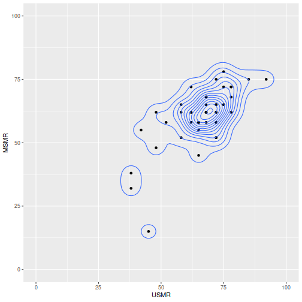

```r
library(tidyverse)
msmr <- readxl::read_xlsx("~/Downloads/msmr_2021_report_marking.xlsx") 
```

```
## New names:
## * `` -> ...1
## * `` -> ...2
## * `` -> ...3
## * `` -> ...4
## * `` -> ...5
## * ...
```

```r
names(msmr)<-as.character(msmr[1,])
msmr<-msmr[-1,]
usmr <- readxl::read_xlsx("~/Downloads/usmr_markingspreadsheet.xlsx")
usmr %>% janitor::clean_names() -> usmr
msmr %>% janitor::clean_names() -> msmr

usmr %>% select(exam_number, rounded_to_psych_scale) %>%
  left_join(., msmr %>% transmute(exam_number=examnr, msmr = as.numeric(nearest))) %>%
  ggplot(.,aes(x=rounded_to_psych_scale,y=msmr))+geom_point()+
  labs(y="MSMR",x="USMR")+
  geom_density_2d()+
  xlim(0,100)+ylim(0,100)
```

```
## Joining, by = "exam_number"
```

```
## Warning: Removed 41 rows containing non-finite values (stat_density2d).
```

```
## Warning: Removed 41 rows containing missing values (geom_point).
```



